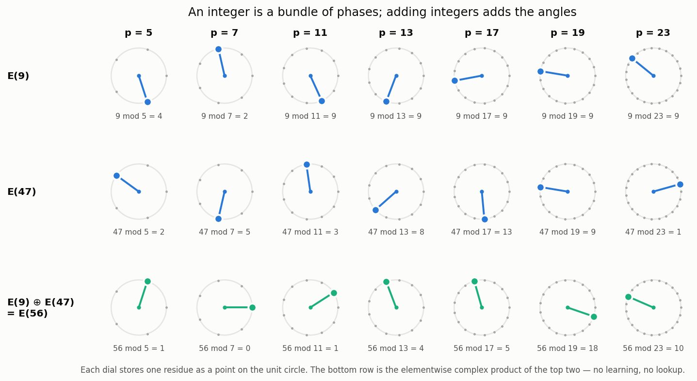
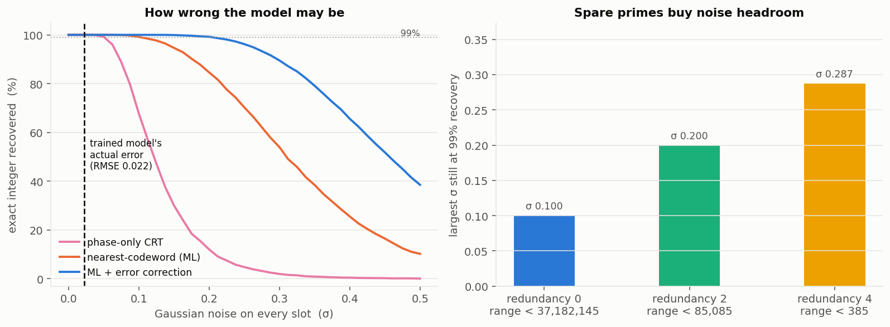
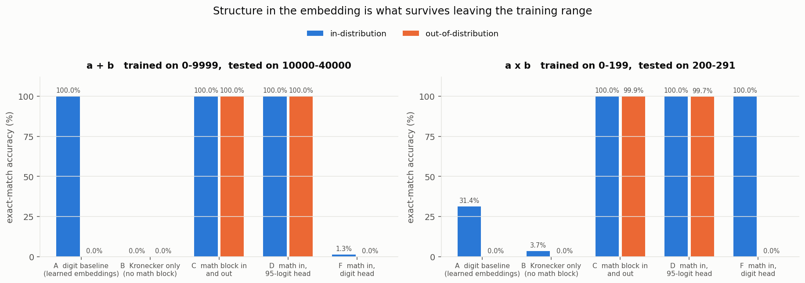
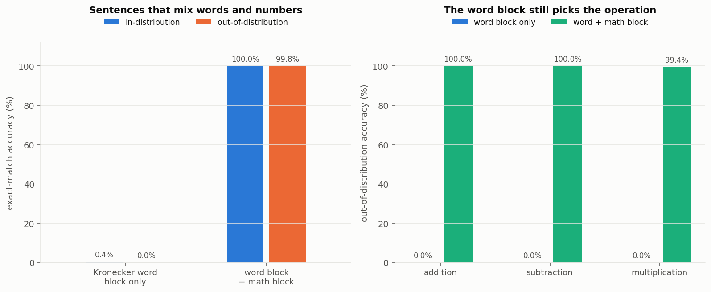

# Embeddings that already know what nine is

**ERA V5 · Session 7 assignment · Problem 1 — mathematical structure inside the embedding**

> *"What if embeddings can store mathematical structure as well. Say 9 — somehow it has stored the
> meaning of 9 (in absolute math terms), such that when we actually do 9 + 9, the mathematical meaning
> part of the embeddings is itself 18! When we do 9\*9 it becomes 81! How much can we push? … Of course
> we need some space for alphabets/words as well, for that we can use 32 existing spaces, and add this
> new concept into new ones (that are appended)!"*

```python
from ringemb import MathCodec

codec = MathCodec.for_integers()
nine  = codec.encode(9)                      # 35 numbers, appended after the Kronecker word block

codec.decode(codec.add(nine, nine))[0]       # -> 18
codec.decode(codec.mul(nine, nine))[0]       # -> 81
codec.decode(codec.powk(nine, 2))[0]         # -> 81
```

Nothing above is trained. `add` and `mul` are elementwise complex products; the arithmetic is a
property of the encoding, not of a model.

**Interactive version: open [`web/index.html`](web/index.html)** — one self-contained file, no server
and no build step. It ships JavaScript ports of the codec, of the 373-dimensional linear-refresh
variant, and of the Kronecker word block, so nothing on the page is replayed; every table is computed
as you read it. One tab per experiment, each with the implementation walked through and a widget that
runs it:

| tab | what is in it |
|---|---|
| **How it works** | the explainer. Type any two numbers and watch the construction happen on them — the two dial lattices for a prime you pick, the CRT table, the discrete-log table, the 35 slots laid out, and four ways to encode a number under noise. |
| **E1 · exactness** | re-run any of the eleven E1 checks in the browser at up to 50,000 trials. Plus the **round-trip panel** (both paths of the commuting square, compared slot by slot, with a toggle that stops before the refresh), the division certificate — including a live demonstration that *multiplying back* does not verify a quotient — and rational arithmetic on the 30-dim preset. |
| **E2 · noise** | one block coming apart under the σ slider, with the per-prime residues that broke; and a live re-run of the whole σ sweep, drawn over the stored 20,000-trial curve. |
| **E3 · transformer** | the exact input tensor each of the five arms receives, built live; a computed account of *why* the digit head scores exactly 0% out of range (it enumerates the digit values never supervised in training); what each of the three heads costs; and the E2 budget plotted against the E3 measurement. |
| **E4 · sentences** | the tokenizer: build a sentence from the twelve surface forms and watch all 11 left-padded tokens become feature vectors, with a toggle that zeroes the math block to give you the control arm. Plus the word block, computed from bytes for any token you type. |
| **E5 · linear glue** | the real 373-dimensional codec, running. Arithmetic in it, the linearity check `f(αx+βy) = αf(x)+βf(y)` on random vectors — against the compact codec's lookup refresh, which fails it — and the fixed `F`, `G`, `Q` matrices drawn. |

---

## Results at a glance

| | claim | measured |
|---|---|---|
| **E1** | the algebra is exact, with zero parameters | **2,816,123 / 2,816,123** checks correct (100.000000%) |
| **E2** | a noisy model can still decode it | exact recovery ≥99% up to **σ = 0.20** per slot |
| **E3** | a transformer generalises past its training range | **100%** / **99.94%** out-of-distribution (a+b / a×b) vs **0%** / **0%** for the digit baseline |
| **E4** | words and numbers coexist in one sentence | **99.79%** OOD with the math block, **0.01%** without |
| **E5** | the construction can be made fully linear | exact to 1e-14, for 373 dims instead of 35 |

---

## 1. Why one operation cannot do both

The tempting design is a single embedding and a single vector operation that somehow yields both sums
and products. That cannot exist. If `⊕` were one abelian-group operation on the embedding, then
`E` would be a homomorphism from `(ℤ, +)` *and* from `(ℤ, ×)` into the same group with the same
operation — but `+` and `×` do not agree on ℤ, so the two would collide.

So the design here uses **two operations, `⊕` and `⊗`**, which is what you would expect: `+` and `×`
are different operators, so they get different bilinear maps. What is shared is the *representation*:
one block of numbers serves both, and each operation is the same primitive — an elementwise complex
product — applied to a different channel of it.

## 2. The construction

An integer is stored as a bundle of **phases**, taken modulo several coprime primes.

**Additive channel.** For prime `p`, store the angle `α_p(n) = 2π · (n mod p) / p` as a `(cos, sin)`
pair. Adding integers adds these angles, and adding an angle is complex multiplication of the pair.
The Chinese Remainder Theorem then reassembles the exact integer from the residues.

**Multiplicative channel.** Multiplication mod `p` is *addition of discrete logarithms*, so store a
second angle `μ_p(n) = 2π · dlog_g(n mod p) / (p−1)`. Multiplying integers adds these angles too.

**Zero flag.** `dlog(0)` does not exist, so one slot per prime records `n ≡ 0 (mod p)`. Under `⊗` it
updates as `z ← z_a + z_b − z_a z_b`, which is bilinear, and it doubles as the block's own
invertibility certificate (see §3).



### Layout and cost

Five real numbers per prime — `[cos α, sin α, cos μ, sin μ, zero flag]`:

| primes | dims | exact range |
|---|---|---|
| 5, 7, 11, 13, 17, 19, 23 | **35** | 0 … 37,182,144 |
| 101, 103, 107, 109, 113, 127 | 30 | 0 … 1.74 × 10¹² |

35 dimensions on top of an 8096-wide model width is **0.43%** of the embedding. It is appended after
the existing Kronecker byte-window, which is left completely untouched — words keep their 32 slots,
mathematics gets its own.

### The two operations

```
a + b :   elementwise complex product of the ADD channels     (exactly E(a+b))
a × b :   elementwise complex product of the MUL channels
          + z ← z_a + z_b − z_a·z_b                            (exactly E(a·b))
```

Each is followed by a **refresh** that rebuilds the other channel, so the result is a well-formed
embedding you can feed into the next operation. In `codec.py` the refresh is a fixed lookup of `p`
entries per prime — parameter-free, but not linear. §E5 shows it can be made a fixed *matrix*.

### Decoding

Three decoders, in increasing order of how much noise they survive:

1. **phase-only** — read one angle per prime, CRT.
2. **nearest codeword (ML)** — every residue is stored *twice* (additive angle and multiplicative
   angle) plus the zero flag, so picking the nearest of the `p` legal 5-dim slot patterns is maximum
   likelihood under Gaussian noise and uses roughly twice the evidence. Free accuracy, same storage.
3. **ML + error correction** — treat spare primes as redundancy (a redundant residue number system):
   reconstruct from every drop-one subset and keep the candidate consistent with the most residues.
   One corrupted residue gets repaired instead of turning 1234 into 30,716,919.

## 3. How far it pushes

Everything below is verified in E1.

| operation | how | exact? |
|---|---|---|
| `a + b`, `a − b`, `−a` | complex product / conjugate on the additive channel | yes |
| `a × b` | complex product on the multiplicative channel | yes |
| `a ** k` | scale the multiplicative angle by `k` — one scalar multiply | yes |
| `a / b` | conjugate the multiplicative angle | yes, when `gcd(b, M) = 1` |
| **rationals** | each prime channel is a *field*, so `p/q` is just `encode(p) ÷ encode(q)` | yes |

Rationals are the interesting one. The same 30-number block stores ℚ, not merely ℤ, and stays closed
under all four operations; reading it back is lattice rational reconstruction:

```
153/142 + 271/154 = 15511/5467      153/142 × 271/154 = 41463/21868
 74/25  + (−23/47) = 2903/1175        74/25 × (−23/47) = −1702/1175
```

20,000/20,000 recovered exactly. Denominators must be coprime to `M`; with primes chosen above the
denominator range that is 96% of 1…300, and the remaining 4% **fail loudly rather than silently** —
the zero flags are a local certificate that the divisor is invertible. (Verifying a division by
multiplying back does *not* work, because a zero divisor admits many quotients that pass that check;
this is checked explicitly in E1.)

## 4. Experiments

Everything reproduces with `./run_all.sh` (about 8 minutes on an M-series Mac; `results/*.json` holds
the raw output). Seeds are fixed and every number below was checked against a second full run. One
cell moves: the digit baseline's in-distribution `a×b` score varies by a few tenths of a point
(31.42% / 31.61% across two runs) because the MPS backend's kernels are not bit-deterministic. Every
other cell, including all of the out-of-distribution results, reproduced exactly.

### E1 — the algebra is exact, with zero parameters

2.8 million randomised checks across the full 37M range: addition, multiplication, zero operands,
subtraction, powers, division, four-step composed expressions `((a+b)·c)−d`, rational arithmetic, and
the round trip below.

```
OVERALL  2,816,123/2,816,123 = 100.000000%
```

The bare bilinear step — one elementwise complex product, no lookup, no branch, no parameters —
reproduces `E(a+b)`'s additive channels to **1.9 × 10⁻¹⁵**.

**The round trip.** Decoding to the right integer is weaker than what is actually claimed. The claim
is that the square commutes — that operating on the embeddings *is* embedding the result:

```
   (a, b)  ──── a op b ────►   y
      │                        │
   encode                   encode
      ▼                        ▼
 (E(a), E(b)) ─── ⊗ ─────► E(a) ⊗ E(b)   ==   E(y)
```

| operation | pairs | blocks identical | largest slot difference |
|---|---|---|---|
| `a + b` | 200,000 | 200,000 | 0.0 |
| `a − b` | 200,000 | 200,000 | 0.0 |
| `a × b` | 200,000 | 200,000 | 0.0 |
| `a ÷ b` (invertible divisors) | 98,374 | 98,374 | 0.0 |

Not "within rounding" — bit-for-bit equal, because the refresh rebuilds the block from its decoded
residues. Before that refresh the raw product already agrees to ~10⁻¹⁵ on the channel the operation
acts on, and the other channel is stale; repairing it is the whole job of the refresh. The webapp's
round-trip panel lets you watch both halves of that.

### E2 — how wrong the model may be

The objection raised in the session was that decoding by similarity fails because early in training
nothing is close to anything. So the question that matters is the noise budget. Gaussian noise of
scale σ is applied to every slot:



| decoder | largest σ still at 99% exact recovery |
|---|---|
| phase-only CRT | 0.050 |
| nearest codeword (ML) | 0.100 |
| **ML + error correction** | **0.200** |

Spare primes can be spent on representable range *or* on noise headroom, and the knob is explicit:
redundancy 0 gives a 37,182,145 range at σ 0.100; redundancy 2 gives 85,085 at σ 0.200; redundancy 4
gives 385 at σ 0.288.

### E3 — what a transformer does with it

Five arms share one backbone — 2 layers, 4 heads, `d_model` 128, ~415k parameters each — so any
difference comes from the embedding and the head, not from capacity. Numbers are single tokens
(the Kronecker block computes an embedding from their bytes, so an unseen number is still
representable). Each arm is scored in-distribution and on operands **strictly larger than anything
seen in training**.



| arm | a+b in-dist | a+b OOD | a×b in-dist | a×b OOD |
|---|---|---|---|---|
| A digit baseline (learned embeddings, digit head) | 100.00% | **0.00%** | 31.42% | **0.00%** |
| B Kronecker only → math block | 0.00% | 0.00% | 3.67% | 0.00% |
| **C math block in and out** | **100.00%** | **100.00%** | **100.00%** | **99.94%** |
| D math in, 95-logit residue head | 100.00% | 100.00% | 100.00% | 99.67% |
| F math in, ordinary digit head | 1.31% | 0.00% | 100.00% | 0.00% |
| closed form, 0 parameters | 100.00% | 100.00% | 100.00% | 100.00% |

Three things worth reading off this table.

**The baseline fails exactly where you would expect.** It learns `a+b` perfectly on 0–9999 and then
scores 0% on 10000–40000. Nothing is wrong with it; magnitude simply is not in its embedding.

**Arm F is the most informative row.** Structure on the *input* alone is not enough: with the math
block in and a digit head out, multiplication reaches 100% in-distribution and still collapses to 0%
outside it. The generalisation comes from the input and the output speaking the same language.

**The predicted error budget matched the measured one.** E2 said the decode holds to σ ≈ 0.20. Arm C's
actual OOD block RMSE was **0.022** (addition) and **0.098** (multiplication) — comfortably inside the
budget, and derived independently of it.

Arm D is worth a footnote for anyone counting memory: predicting residues needs **95 logits total**
(one small softmax per prime) rather than a 131,072-wide vocabulary head, at 99.67% OOD.

### E4 — words in the Kronecker slots, mathematics in the appended slots

E3 fed the model a bare expression. This one feeds it sentences, across twelve surface forms and
three operations, so it has to read the *words* to know what is being asked while doing arithmetic on
numbers larger than any it saw in training:

```
take 165 away from 1752 and you have  ->  1587
the product of 61 and 8 is            ->  488
the difference between 9127 and 6494 is  ->  2633
```

Both arms see identical sentences and identical word blocks. The only difference is whether the
appended math dimensions are populated or zeroed.



| arm | in-dist | OOD | OOD add | OOD sub | OOD mul |
|---|---|---|---|---|---|
| Kronecker word block only | 0.44% | 0.01% | 0.00% | 0.00% | 0.00% |
| **word block + math block** | **100.00%** | **99.79%** | 100.00% | 100.00% | 99.40% |

The per-operation split is the point: the word block still picks the operation, the math block still
does the arithmetic, and they do not interfere.

### E5 — the glue can be linear

`codec.py` refreshes one channel from the other with a fixed lookup. Parameter-free, but nonlinear,
and a reviewer is entitled to ask whether the whole thing can be done with nothing but complex
products and fixed matrices. It can. Store the *full character basis* per prime rather than one
harmonic — the additive characters are the DFT of the residue indicator over ℤ_p, the multiplicative
characters are the DFT of the same indicator over ℤ_{p−1} after relabelling by discrete log — and
both changes of basis become fixed unitary matrices:

```
add -> mul :   delta = Finv·A ;  z = delta[0] ;  X = G·Q·delta
mul -> add :   delta = [ z ; Qᵀ·Ginv·X ] ;       A = F·delta
```

Verified: addition and multiplication both 20,000/20,000 exact, deviation from `E(a+b)` / `E(a·b)`
under 3.3 × 10⁻¹⁴, and the refresh maps satisfy `f(αx+βy) = αf(x)+βf(y)` to 5 × 10⁻¹⁵. The price is
**373 dimensions instead of 35**. The compact codec is what you would ship; this is what you would
cite.

## 5. Limitations

Stated plainly, because they bound what the construction is good for.

- **It is a ring ℤ_M, not ℤ.** Arithmetic wraps at `M`. Choosing primes chooses the range, and
  exceeding it is silent unless you spend redundancy — with redundancy 2, an out-of-range value fails
  the consistency check and is flagged.
- **No order.** CRT is not order-preserving, so nothing in the block tells you `9 < 81`. Comparison
  would need a separate monotone channel (a signed log-magnitude scalar); that is not implemented and
  it would not be exact.
- **Division needs a coprime divisor**, as §3 describes. Detected, not silent.
- **Something must populate the block.** The tokenizer side has to recognise a numeral and write its
  residues; a number that arrives as an ordinary word gets a zeroed math block. That plumbing is
  assumed here, not built.
- **Scale.** These are toy transformers (0.4M–1.4M parameters) on synthetic arithmetic. The evidence
  says the representation is learnable and that it generalises out of range at this scale. It does
  *not* say anything yet about whether a 120B model trained on real text picks it up, or whether the
  math block survives contact with a full pre-training mixture.
- **Arm B is a weak negative.** Kronecker-only scoring 0% means "not learnable in this budget", not
  "impossible in principle".

## 6. Running it

```bash
pip install -r requirements.txt
./run_all.sh                 # every experiment, then the figures and the webapp
open web/index.html          # interactive version
```

Individual pieces:

```bash
python3 experiments/e1_exactness.py 200000
python3 experiments/e2_noise.py 20000
python3 experiments/e3_transformer.py --task add --steps 6000
python3 experiments/e3_transformer.py --task mul --steps 6000
python3 experiments/e4_mixed_lm.py --steps 8000
python3 experiments/e5_linear_refresh.py 20000
```

```
ringemb/
  codec.py           the math block: encode, decode, the algebra, ML + error-correcting decoders
  linear_refresh.py  the full-character variant, where both refreshes are matrix multiplies
  rationals.py       lattice rational reconstruction
  kronecker.py       a faithful miniature of the V4 byte-window word block (frozen, untrained)
  model.py           one small transformer, shared by every arm
  data.py            arithmetic problems and the two ways of presenting them
experiments/         E1–E5 and the figure generator
web/                 codec.js, linear.js, kron.js  ports of the three objects above
                     app.js, panels.js             the UI; one panel per experiment
                     build.py -> a self-contained index.html
                     smoketest.js runs the page's scripts under a DOM shim (node web/smoketest.js)
results/             raw JSON, logs, and figures
```

## 7. What I would do next

1. **Order.** A monotone magnitude channel that coexists with the residue channels is the obvious
   missing piece, and the honest version of it is approximate, so it needs its own error analysis.
2. **Does it survive a real mixture?** Put the block into a small but genuine pre-training run and
   check whether the arithmetic behaviour holds once most tokens are prose.
3. **Learned operator selection.** Right now `⊕` and `⊗` are chosen by the experiment. In a real model
   the network should choose, ideally following the principle from the session — give it the operator
   and let it decide not to use it.
4. **Wider algebra.** Polynomials over ℤ_M are a short step from here (coefficient-wise blocks), which
   would put derivatives and symbolic manipulation in reach. Vectors and units are further out and I
   do not yet have a construction I believe in.

*Aside, out of scope for this problem: the ML decoder in §2 is a reverse map from a noisy embedding
back to a token, and arm D replaces a 131k-wide head with 95 logits. Both are relevant to problem 5;
neither is pursued here.*
